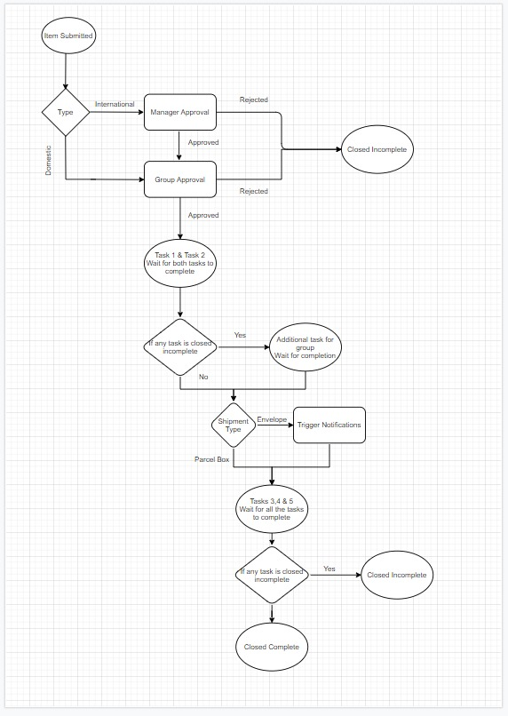

### Introduction
Shipping Logistics is one of the hardest problems for a company to solve.  The transport and logistics industry is the back bone of any economy, and the driving force behind all setors, be it agriculture, manufacturing or services.

In this project, I am using Servicenow Service Portal to give user a friendly interface to submit a shipping request. The workflow will automate the entire process by assign the catalog task to predefined group using assignment rule. The user requested for will receive an email notification whenever the request is approved by the person in charge.

### Form Layout

| Variable | Type | Behaviour |
|---------|--------|-------------|
| requester          | list of Uers |Default is list of users |
| requested for                | list of users | default is logged in user but can be editable |
| location             | list of locations | requestor for's location by default |
| shipping type          | domestic / international | default should be none |
| origin | list of locations | requestor for's lo
cation by default |
| destination address | text input-large | should accept text with multiple lines |
| city | list of locations | only cities in the location table |
| state | text input | should accept text input |
| country | list of locations | only countries from the location table |
| shipment type | dropdown | default should be none |
| number of envelopes | text input | should accept only numbers |

### Workflow

